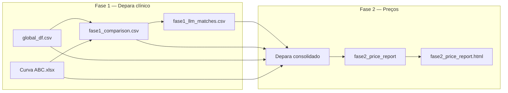

# Global Analytics — Depara Unimed × Global

Comparativo de preços entre a **Global** (distribuidora) e a **Unimed** (referência de compras), após **depara clínico** entre catálogos que usam códigos de produto diferentes.

O foco comercial do relatório é identificar **oportunidades**: linhas em que a Global oferece preço **abaixo** do que a Unimed paga hoje, com depara e unidade de comparação validados.

---

## Contexto do problema

| Sistema | Papel | Identificador |
|---------|-------|---------------|
| **Global** | Distribuidora — histórico de custos de entrada por SKU/marca | `COD_PRODUTO`, agrupado em `LINHA_PRODUTO` |
| **Unimed** | Compras — Curva ABC com VL Médio de referência | `Cod Item` |

Os códigos **não batem** entre os sistemas. A comparação de preço só faz sentido depois de mapear:

```
LINHA_PRODUTO (Global)  →  cod_item (Unimed / Curva ABC)
```

Esse mapeamento é o **depara clínico** (mesma substância, dose, forma farmacêutica ou material equivalente).

---

## Fontes de dados

Arquivos esperados em `data/depara-unimed/`:

| Arquivo | Entidade | Coluna de preço | Conteúdo |
|---------|----------|-----------------|----------|
| `global_df.csv` | Global (distribuidor) | `CUSTO_ENTRADA` | Entradas por SKU — várias marcas por linha clínica |
| `Curva ABC - CD 05.26.xlsx` | Unimed (compras) | `VL Médio (R$)` | Catálogo de referência, ABC, Prev Mês |

Encoding do CSV Global: `latin-1`.

> **Nota:** nomes legados de variáveis de ambiente (`DEPARA_UNIMED_PATH`, `DEPARA_GLOBAL_PATH`) ainda funcionam como alias — veja [Configuração](#configuração).

---

## Pipeline em duas fases



### Fase 1 — Similaridade + LLM

1. **Similaridade (fuzzy, TF-IDF, spaCy)**  
   Para cada linha clínica Global, ranqueia candidatos `cod_item` Unimed e classifica confiança (`alta`, `media`, `baixa`, `revisar`).

2. **LLM (pydantic-ai)**  
   Refina o depara nas linhas de baixa confiança, com candidatos pré-filtrados e cache SQLite.

**Saídas principais:**
- `fase1_comparison.csv` — scores por método + `best_cod_item`
- `fase1_matches_long.csv` — formato longo (opcional, notebook)
- `fase1_llm_matches.csv` — decisões LLM (`match` / `no_match`)
- `llm_cache.sqlite` — cache de chamadas à API

### Fase 2 — Comparativo de preços

Consolida depara (LLM + fuzzy alta), agrega custos Global por linha (mediana, último, etc.), cruza com VL Médio Unimed e gera:

- `fase2_price_report.csv` / `.xlsx` — por linha clínica
- `fase2_price_sku.csv` — detalhe por SKU/marca Global
- `fase2_price_report.html` — dashboard interativo

---

## Métricas importantes

| Métrica | Significado |
|---------|-------------|
| **Gap %** | `(mediana Global − ref. Unimed/un) / ref. Unimed/un × 100` |
| **Gap &lt; 0** | Global **mais barata** → oportunidade comercial |
| **Gap &gt; 0** | Global **mais cara** → risco de perda de competitividade |
| **oportunidade_mensal_rs** | `(ref. Unimed/un − mediana Global/un) × Prev mês qtd` |
| **preco_depara_ok** | Depara compatível com preços (ratio entre 0,25× e 4×) |
| **flags_revisao** | Sinais de revisão manual (depara ≠ preço, outlier, match fraco, etc.) |

Preços Unimed são **normalizados por unidade** quando a descrição indica embalagem (`cx c/100`, `c/ 500 und`, etc.) — ver `depara/price_units.py`.

---

## Estrutura do projeto

```
global-analytics/
├── depara/
│   ├── cli.py                 # Interface de linha de comando
│   ├── fase1_similarity.py    # Similaridade texto (fase 1)
│   ├── fase2_prices.py        # Relatório de preços (fase 2)
│   ├── price_sanity.py        # Flags e gaps normalizados
│   ├── price_units.py         # Caixa/kit → preço por unidade
│   ├── report_html.py         # Dashboard HTML
│   ├── sources.py             # Legenda e exportação legível
│   └── llm/
│       ├── agent.py           # Prompt de depara clínico
│       ├── matcher.py         # Orquestração LLM em lote
│       ├── candidates.py      # Retrieval de candidatos
│       ├── reanalyze.py       # Reanálise de depara com preço incompatível
│       └── config.py          # Settings (.env)
├── data/depara-unimed/        # Dados e artefatos gerados
├── depara-unimed-global.ipynb # EDA + geração da fase 1 (similaridade)
├── pyproject.toml
└── .env.example
```

---

## Setup

Requisitos: **Python ≥ 3.13**, [uv](https://github.com/astral-sh/uv).

```bash
# bash
cd global-analytics
uv sync
uv run python -m spacy download pt_core_news_md
cp .env.example .env
# Edite .env com OPENAI_API_KEY e DEPARA_MODEL
```

```fish
# fish
cd global-analytics
uv sync
uv run python -m spacy download pt_core_news_md
cp .env.example .env
# Edite .env com OPENAI_API_KEY e DEPARA_MODEL
```

---

## Guia rápido (do zero ao relatório)

### 1. Gerar `fase1_comparison.csv`

Rode o notebook `depara-unimed-global.ipynb` (células de similaridade) **ou** via Python:

```bash
uv run python -c "
from depara.fase1_similarity import run_all_methods
_, fase1 = run_all_methods(
    'data/depara-unimed/global_df.csv',
    'data/depara-unimed/Curva ABC - CD 05.26.xlsx',
)
fase1.to_csv('data/depara-unimed/fase1_comparison.csv', index=False)
print(len(fase1), 'linhas')
"
```

### 2. Rodar depara LLM

```bash
# Estimar custo antes
uv run python -m depara.cli estimate --all

# Ver fila por prioridade (Prev Mês × incerteza)
uv run python -m depara.cli priority --limit 20

# Produção — todas as linhas media+baixa+revisar
uv run python -m depara.cli run --all

# Teste local sem API
uv run python -m depara.cli test --limit 5
```

### 3. Gerar relatório de preços + HTML

```bash
uv run python -m depara.cli prices
uv run python -m depara.cli report
```

Abra `data/depara-unimed/fase2_price_report.html` no navegador.

### 4. (Opcional) Reanalisar deparas com preço incompatível

```bash
uv run python -m depara.cli reanalyze-prices --regenerate-report
```

---

## Comandos CLI

Invocação: `uv run python -m depara.cli <comando>` ou `uv run depara <comando>` (script instalado).

| Comando | Descrição |
|---------|-----------|
| `test` | Pipeline com TestModel (sem API) |
| `estimate` | Estima tokens e custo USD |
| `priority` | Fila de execução LLM por impacto |
| `run` | Depara LLM em produção |
| `one <linha>` | Testa uma linha clínica específica |
| `prices` | Gera CSV/XLSX fase 2 |
| `report` | Gera HTML a partir do CSV |
| `reanalyze-prices` | Refaz depara onde preço não fecha |
| `clear-cache` | Apaga `llm_cache.sqlite` |

Opções úteis de `run`:

```bash
uv run python -m depara.cli run --all              # media + baixa + revisar
uv run python -m depara.cli run --filter revisar   # só revisar (default)
uv run python -m depara.cli run --limit 50         # primeiras N da fila
uv run python -m depara.cli run --no-cache
```

---

## Configuração

Copie `.env.example` → `.env`. Variáveis principais:

| Variável | Default | Descrição |
|----------|---------|-----------|
| `OPENAI_API_KEY` | — | Obrigatória em modo `prod` |
| `DEPARA_MODEL` | `openai:gpt-4o-mini` | Modelo do depara clínico |
| `DEPARA_REANALYZE_MODEL` | `openai:gpt-4o` | Modelo da reanálise de preço |
| `DEPARA_REANALYZE_TOP_K` | `50` | Candidatos na reanálise |
| `DEPARA_TOP_K_CANDIDATES` | `12` | Candidatos por linha no LLM |
| `DEPARA_MAX_CONCURRENCY` | `5` | Chamadas paralelas |
| `DEPARA_MODE` | `prod` | `test` = sem API |
| `DEPARA_GLOBAL_DISTRIBUIDOR_PATH` | `data/depara-unimed/global_df.csv` | CSV Global |
| `DEPARA_UNIMED_CATALOGO_PATH` | `data/depara-unimed/Curva ABC - CD 05.26.xlsx` | Curva ABC |

---

## Artefatos em `data/depara-unimed/`

| Arquivo | Gerado por | Uso |
|---------|------------|-----|
| `fase1_comparison.csv` | Notebook / `run_all_methods` | Input do LLM e fase 2 |
| `fase1_llm_matches.csv` | `depara run` | Depara consolidado (LLM) |
| `fase1_llm_priority.csv` | `depara priority` | Fila de execução |
| `fase1_llm_reanalyze.csv` | `reanalyze-prices` | Reanálises de preço |
| `fase2_price_report.csv` | `depara prices` | Dados tabulares legíveis |
| `fase2_price_report.xlsx` | `depara prices` | Abas Legenda + preços |
| `fase2_price_sku.csv` | `depara prices` | Comparativo por marca/SKU |
| `fase2_price_report.html` | `depara report` | Dashboard (oportunidades primeiro) |
| `llm_cache.sqlite` | LLM | Cache — apague se mudar prompt/schema |

O Excel/CSV inclui colunas como `oportunidade_mensal_rs`, `gap_pct_mediana_global_vs_unimed`, `depara_ok_preco` e `flags_revisao`. A aba **Legenda** do XLSX explica cada campo.

---

## Dashboard HTML

Seções principais (em ordem):

1. **Oportunidades** — Global mais barata que a compra Unimed (só `depara_ok_preco`), ordenado por economia mensal estimada
2. **Distribuição de gaps** — histograma e ABC
3. **Risco** — Global mais cara (top 15)
4. **Depara incompatível com preço** — comparações inválidas (unidade errada, match errado)
5. **Linhas com flags** — revisão manual
6. **Tabela completa** — filtros por ABC, gap e busca textual

---

## Limitações conhecidas

- **Cobertura de depara ~50%** — muitas linhas Global ainda sem match LLM/fuzzy.
- **Mesma linha, marcas diferentes** — a mediana Global mistura biosimilares, genéricos e originais; use `fase2_price_sku.csv` para detalhe por marca.
- **Normalização de unidade** — depende de padrões na descrição Unimed (`cx c/100`, etc.); casos ambíguos geram `preco_depara_incompativel`.
- **VL Médio Unimed** — referência histórica; não reflete contrato ou última NF isolada.
- **Outliers de última entrada** — flag `outlier_custo_ultimo` quando último custo Global diverge muito da mediana.

---

## Desenvolvimento

```bash
# Verificar imports
uv run python -m compileall -q depara

# Testar uma linha
uv run python -m depara.cli one "LUVA NITRILICA"
```

O notebook `depara-unimed-global.ipynb` contém EDA exploratório (distribuições, overlap de códigos, gráficos) e a geração inicial da fase 1.

---

## Licença

Uso interno — Global / Unimed. Ajuste conforme política da organização.
