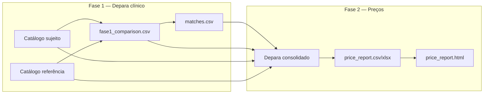

# Global Analytics — Depara clínico + comparativo de preços

Comparativo de preços entre um catálogo **sujeito** (ex.: distribuidora) e um catálogo **referência** (ex.: Curva ABC Unimed), após **depara clínico** entre sistemas com códigos diferentes.

O foco comercial é identificar **oportunidades** (custo abaixo do benchmark) e **riscos** (custo acima), com projeção mensal em R$ quando há volume previsto.

---

## Três formas de usar

| Modo | Para quem | Como |
|------|-----------|------|
| **Streamlit + API** | Analista / farmacêutico sem CLI | Wizard em 5 passos — guia, upload, mapeamento, validação, resultado |
| **FastAPI** | Integração ou automação | Jobs assíncronos com upload + JSON de mapeamento |
| **CLI** | Desenvolvimento e batch local | Comandos `depara` sobre arquivos em `data/depara-unimed/` |

### Streamlit + API (recomendado)

**Um comando** (API + wizard, aguarda health check):

```bash
# bash / fish — primeira vez
make setup

# bash / fish — subir tudo
make up
```

Abre http://127.0.0.1:8501 (Streamlit) e http://127.0.0.1:8000/docs (API).  
Parar tudo: `make down` · Só reiniciar UI (API continua): `make restart-ui` · Status: `make status`

Ou manualmente em dois terminais:

```bash
# bash / fish — terminal 1: API (evite --reload durante jobs longos)
uv run uvicorn depara.api.main:app --port 8000

# bash / fish — terminal 2: wizard
uv run streamlit run depara/ui/app.py
```

- Documentação interativa: http://127.0.0.1:8000/docs
- Presets: custo/estoque, compras históricas ou mapeamento personalizado
- Variáveis LLM na sidebar (vazio = usa `.env` do servidor)
- Downloads: HTML, Excel, CSV e matches ao final

### Job via YAML (CLI batch)

```bash
# bash / fish
uv run depara job configs/job_cost_stock.yaml
```

Configs em `configs/` — ver [Contract layer](#contract-layer-agnóstico).

### CLI clássico (fase a fase)

Ver [Guia CLI](#guia-cli-do-zero-ao-relatório) abaixo.

---

## Contexto do problema

| Sistema | Papel | Identificador |
|---------|-------|---------------|
| **Sujeito (Side A)** | Catálogo analisado — custo/estoque ou compras | `COD_PRODUTO`, `LINHA_PRODUTO` |
| **Referência (Side B)** | Benchmark de preços — ex. Curva ABC | `Cod Item` |

Os códigos **não batem** entre os sistemas. A comparação só faz sentido depois de mapear:

```
LINHA_PRODUTO (sujeito)  →  cod_item (referência)
```

Glossário completo: [CONTEXT.md](CONTEXT.md).

---

## Fontes de dados (exemplo Global × Unimed)

Arquivos em `data/depara-unimed/`:

| Arquivo | Entidade | Coluna de preço | Conteúdo |
|---------|----------|-----------------|----------|
| `global_df.csv` ou `BASE_PRODUTOS_CUSTO_ESTOQUE_*.csv` | Global | `CUSTO_ENTRADA` / `CUSTOREAL` | SKUs ou snapshot custo/estoque |
| `Curva ABC - CD 05.26.xlsx` | Unimed | `VL Médio (R$)` | Catálogo ABC, Prev Mês |
| `BASE_LINHA_PRODUTOS.csv` | Cadastro Global | — | Embalagem/unidade (join por `COD_PRODUTO`) |

Encoding CSV: `latin-1`.

---

## Pipeline em duas fases



### Fase 1 — Similaridade + LLM (opcional)

1. **Similaridade** — fuzzy, TF-IDF, spaCy; classifica confiança por linha.
2. **LLM (pydantic-ai)** — refina depara nas linhas pendentes; cache SQLite.

Saídas: `fase1_comparison.csv`, `matches.csv` (decisões LLM).

### Fase 2 — Comparativo de preços

Agrega custos do sujeito por linha clínica, cruza com preço de referência normalizado por unidade e gera relatório tabular + HTML interativo.

---

## Contract layer (agnóstico)

O módulo `depara/contract/` define templates de colunas e validação para qualquer par **subject × reference**:

| Template sujeito | Uso |
|------------------|-----|
| `global_cost_stock` | Snapshot custo + estoque por SKU |
| `global_purchases` | Histórico de compras |
| `custom` | Mapeamento manual de colunas |

| Template referência | Uso |
|---------------------|-----|
| `unimed_abc` | Curva ABC (`Cod Item`, `VL Médio`, `Prev Mês`) |
| `custom` | Qualquer benchmark |

Jobs YAML (`configs/*.yaml`) ou API/Streamlit usam o mesmo contrato. Regras de preço: [depara/contract/price_rules.md](depara/contract/price_rules.md).

---

## API FastAPI

| Endpoint | Descrição |
|----------|-----------|
| `GET /health` | Health check |
| `POST /v1/validate` | Valida mapeamento (upload + config JSON) |
| `POST /v1/jobs` | Cria job assíncrono (202) |
| `GET /v1/jobs` | Lista jobs recentes |
| `GET /v1/jobs/{id}` | Status e URLs de artefatos |
| `POST /v1/jobs/{id}/retry` | Reexecuta job falho |
| `GET /v1/jobs/{id}/artifacts/{name}` | Download (csv, xlsx, html, json) |

Jobs ficam em `exports/api_jobs/{id}/`. `env_overrides` no config sobrescreve variáveis LLM só durante a execução.

---

## Métricas importantes

| Métrica | Significado |
|---------|-------------|
| **Gap %** | Diferença percentual custo sujeito vs referência/unidade |
| **Gap &lt; 0** | Sujeito **mais barato** → oportunidade |
| **Gap &gt; 0** | Sujeito **mais caro** → risco |
| **oportunidade_mensal_rs** | Economia mensal estimada (linhas plausíveis) |
| **preco_depara_ok** | Ratio de preços entre 0,25× e 4× |
| **flags_revisao** | Sinais para revisão manual |

Guia executivo do relatório: [data/depara-unimed/fase2_price_report_guia.md](data/depara-unimed/fase2_price_report_guia.md).

---

## Estrutura do projeto

```
global-analytics/
├── depara/
│   ├── api/                   # FastAPI — jobs assíncronos
│   ├── ui/                    # Streamlit wizard
│   ├── contract/              # Templates, ingest, validação
│   ├── pipeline/              # run_job, fase1, summary
│   ├── medication/            # Identidade clínica L2 + sinais
│   ├── cli.py                 # CLI clássica
│   ├── fase1_similarity.py
│   ├── fase2_prices.py
│   ├── price_sanity.py
│   ├── price_units.py
│   ├── report_html.py
│   └── llm/                   # Agent, matcher, reanalyze
├── configs/                   # Jobs YAML (global_cost_stock, etc.)
├── data/depara-unimed/        # Dados e artefatos locais
├── exports/                   # Jobs API e pilotos (gitignored recomendado)
├── tests/
├── CONTEXT.md                 # Glossário de domínio
└── pyproject.toml
```

---

## Setup

Requisitos: **Python ≥ 3.13**, [uv](https://github.com/astral-sh/uv).

```bash
# bash
cd global-analytics
make setup
```

```fish
# fish
cd global-analytics
make setup
```

`make setup` roda `uv sync`, baixa o modelo spaCy e copia `.env.example` → `.env` se ainda não existir.

---

## Guia CLI (do zero ao relatório)

### 1. Gerar `fase1_comparison.csv`

Notebook `depara-unimed-global.ipynb` **ou**:

```bash
uv run python -c "
from depara.fase1_similarity import run_all_methods
_, fase1 = run_all_methods(
    'data/depara-unimed/global_df.csv',
    'data/depara-unimed/Curva ABC - CD 05.26.xlsx',
)
fase1.to_csv('data/depara-unimed/fase1_comparison.csv', index=False)
print(len(fase1), 'linhas')
"
```

### 2. Depara LLM

```bash
uv run depara estimate --all
uv run depara priority --limit 20
uv run depara run --all          # produção
uv run depara test --limit 5     # sem API
```

### 3. Relatório de preços

```bash
uv run depara prices
uv run depara report
```

### 4. (Opcional) Reanálise de preço

```bash
uv run depara reanalyze-prices --regenerate-report
```

---

## Comandos CLI

| Comando | Descrição |
|---------|-----------|
| `job <config.yaml>` | Pipeline end-to-end via YAML |
| `test` | TestModel (sem API) |
| `estimate` | Tokens e custo USD |
| `priority` | Fila LLM por impacto |
| `run` | Depara LLM em produção |
| `one <linha>` | Uma linha clínica |
| `prices` | CSV/XLSX fase 2 |
| `report` | HTML a partir do CSV |
| `reanalyze-prices` | Depara com preço incompatível |
| `clear-cache` | Apaga `llm_cache.sqlite` |

---

## Configuração

Copie `.env.example` → `.env`:

| Variável | Default | Descrição |
|----------|---------|-----------|
| `OPENAI_API_KEY` | — | Obrigatória em modo `prod` |
| `DEPARA_MODEL` | `openai:gpt-4o-mini` | Modelo do depara clínico |
| `DEPARA_REANALYZE_MODEL` | `openai:gpt-4o` | Reanálise de preço |
| `DEPARA_REANALYZE_TOP_K` | `50` | Candidatos na reanálise |
| `DEPARA_TOP_K_CANDIDATES` | `12` | Candidatos por linha no LLM |
| `DEPARA_MAX_CONCURRENCY` | `5` | Chamadas paralelas |
| `DEPARA_MODE` | `prod` | `test` = sem API |
| `DEPARA_GLOBAL_DISTRIBUIDOR_PATH` | `data/.../global_df.csv` | CSV sujeito (legado) |
| `DEPARA_UNIMED_CATALOGO_PATH` | `data/.../Curva ABC....xlsx` | Referência (legado) |

---

## Desenvolvimento

```bash
# bash / fish — lint
uv run ruff check depara tests

# bash / fish — testes
uv run pytest tests/ -q

# bash / fish — smoke do stack local (API + Streamlit)
make smoke
```

---

## Limitações conhecidas

- Cobertura de depara parcial — muitas linhas ainda sem match LLM/fuzzy.
- Mediana Global mistura marcas na mesma linha clínica — use detalhe por SKU quando existir.
- Normalização de unidade depende de padrões na descrição (`cx c/100`, etc.).
- VL Médio é referência histórica, não contrato vigente.
- Jobs API em thread local — restart do uvicorn com `--reload` interrompe execução (use retry).

---

## Licença

Uso interno — Global / Unimed. Ajuste conforme política da organização.
