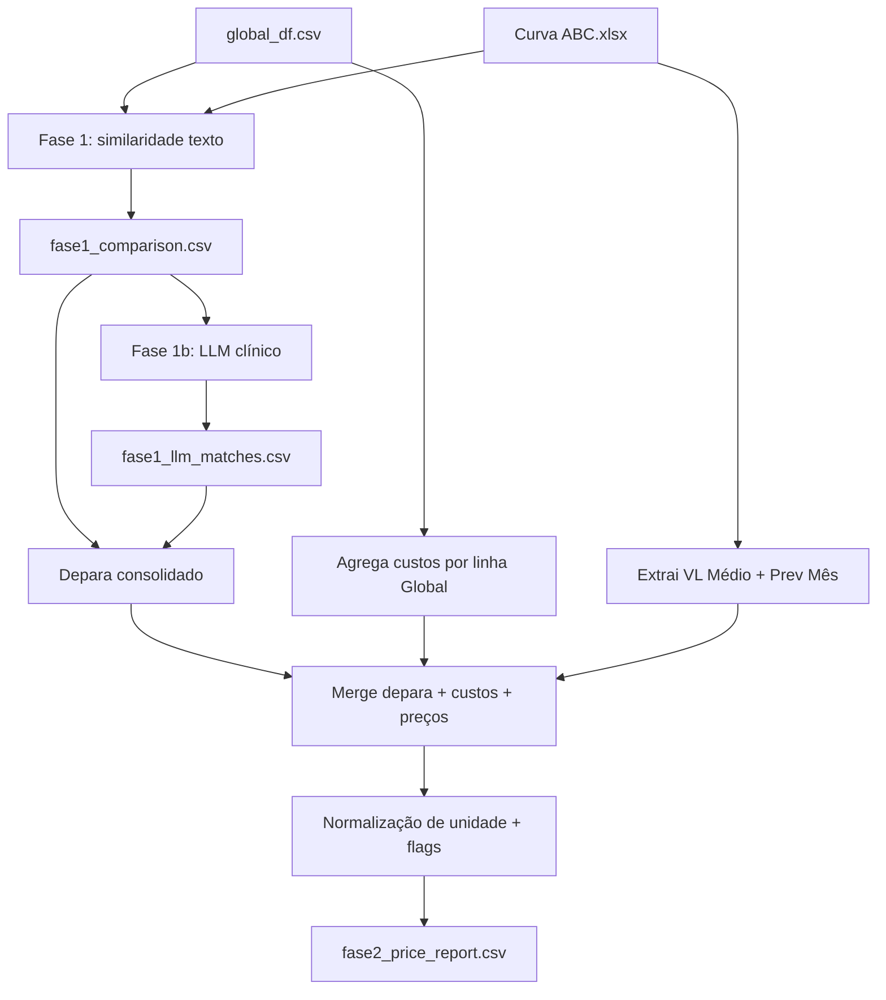

# Guia técnico — `fase2_price_report.csv`

> Documento para explicar a planilha a executivos: do problema de negócio até cada coluna e como interpretar os números.
>
> **Artefato analisado:** `data/depara-unimed/fase2_price_report.csv`  
> **Versão dos dados:** Curva ABC CD 05.26 + `global_df.csv` (snapshot da execução atual)

---

## 1. Propósito (o que a planilha responde)

**Pergunta central:** *Para cada produto que a Global distribui, o preço está acima ou abaixo do que a Unimed paga hoje — e qual o impacto financeiro mensal?*

A planilha é o **resultado final** de um pipeline em duas etapas:

| Etapa | O que faz | Analogia para o executivo |
|-------|-----------|---------------------------|
| **Fase 1 — Depara** | Liga o catálogo Global ao catálogo Unimed | Traduzir "mesmo produto, códigos diferentes" |
| **Fase 2 — Preços** | Compara custo Global × referência Unimed | Ver se a Global é competitiva e quanto vale |

**Unidade de análise:** 1 linha = 1 **linha clínica Global** (`linha_clinica_global`) pareada com 1 **item Unimed** (`unimed_cod_item`).

**Números desta execução:**

| Métrica | Valor |
|---------|-------|
| Linhas clínicas na Global | 1.424 |
| Linhas no relatório | 735 (~52% de cobertura) |
| Itens Unimed distintos | 603 |
| Linhas Global que compartilham o mesmo item Unimed | 132 |
| Depara via LLM | 584 |
| Depara via fuzzy alta | 151 |
| Linhas com `depara_ok_preco = True` | 709 |
| Linhas com `depara_ok_preco = False` | 26 |
| Oportunidades (gap mediana &lt; 0) | 541 |
| Riscos (gap mediana &gt; 0) | 192 |
| Soma `oportunidade_mensal_rs` | ~R$ 621 mil/mês |
| Soma `risco_mensal_rs` | ~R$ 959 mil/mês |

---

## 2. Origem dos dados (de onde vêm os números)

### 2.1 Lado Global — distribuidora

| Aspecto | Detalhe |
|---------|---------|
| Arquivo | `global_df.csv` |
| Entidade | Global (distribuidor) |
| Coluna de preço | `CUSTO_ENTRADA` |
| Granularidade | Cada entrada de estoque por SKU/marca |
| Agrupamento | `LINHA_PRODUTO` — linha clínica (ex.: `SUCCINATO DE RIBOCICLIBE (200MG COMPRIMIDO REV)`) |

**O que é `CUSTO_ENTRADA`:** custo de entrada na distribuidora, histórico por data (`DT_ENTRADA`). **Não é** preço de venda ao cliente final.

### 2.2 Lado Unimed — referência de compras

| Aspecto | Detalhe |
|---------|---------|
| Arquivo | `Curva ABC - CD 05.26.xlsx` |
| Entidade | Unimed (compras) |
| Coluna de preço | `VL Médio (R$)` |
| Granularidade | 1 `Cod Item` = 1 apresentação clínica (sem marca) |
| Contexto comercial | `Prev Mês` (quantidade), `Prev Mês (R$)` (valor), `ABC`, `Política` |

**O que é `VL Médio`:** preço médio de referência que a Unimed usa na Curva ABC — benchmark do que ela paga/compra hoje.

### 2.3 Por que precisa de "depara"

Os códigos **não batem** entre os sistemas:

```
Global: LINHA_PRODUTO + COD_PRODUTO (com marca)
Unimed: Cod Item (sem marca, só apresentação clínica)
```

Sem depara, comparar preço é como comparar "KISQALI 200MG CX 63" com um código interno diferente — o pipeline faz essa tradução antes de calcular qualquer gap.

---

## 3. Como a planilha é construída (pipeline)



### 3.1 Fase 1 — encontrar o par Global ↔ Unimed

**Passo A — Similaridade automática** (`fase1_comparison.csv`)

- Para cada linha Global, ranqueia candidatos Unimed por texto (fuzzy, TF-IDF, spaCy).
- Classifica confiança: `alta`, `media`, `baixa`, `revisar`.

**Passo B — LLM clínico** (`fase1_llm_matches.csv`)

- Refina linhas de baixa confiança.
- Regras: mesma substância, dose, forma farmacêutica, via; ignora marca.
- Usa faixa de preço (0,25× a 4×) para rejeitar matches clinicamente plausíveis mas economicamente impossíveis.
- Decisão: `match` ou `no_match`.

**Passo C — Depara consolidado** (regra de prioridade)

1. **LLM com `match`** → entra no relatório (`depara_origem = llm`)
2. Se a linha não passou pelo LLM, mas fuzzy tem confiança **alta** → entra (`depara_origem = fuzzy_alta`)
3. Linhas sem match em nenhum dos dois → **não aparecem** na planilha

### 3.2 Fase 2 — montar o comparativo de preço

Para cada par deparado:

1. **Agrega custos Global** por linha clínica (todas as entradas históricas): último, média, mediana, min, max.
2. **Busca preço Unimed** pelo `unimed_cod_item`.
3. **Normaliza unidade** Unimed quando a descrição indica embalagem (`cx c/100`, `kit c/500`, etc.) — divide VL Médio pela quantidade.
4. **Calcula gaps** e métricas de oportunidade/risco.
5. **Aplica flags** de revisão quando algo parece inconsistente.

---

## 4. Estrutura da planilha — 35 colunas em 7 blocos

### Bloco A — Identificação Global (quem é o produto na Global)

| Coluna | Significado |
|--------|-------------|
| `linha_clinica_global` | Nome da linha clínica no catálogo Global |
| `principio_ativo` | Princípio ativo associado |
| `marcas_global` | Marcas presentes nessa linha (pode ser mais de uma) |
| `qtd_skus_global` | Quantos SKUs/códigos distintos compõem a linha |
| `qtd_entradas_global` | Quantas entradas de estoque no histórico |

**Para o executivo:** é o "produto Global" que estamos avaliando — pode agrupar várias marcas/embalagens sob o mesmo princípio + apresentação.

---

### Bloco B — Preços Global (R$/unidade)

| Coluna | Significado | Quando usar |
|--------|-------------|-------------|
| `preco_global_ultimo_r_un` | Último `CUSTO_ENTRADA` registrado | Visão mais recente; sensível a outlier |
| `preco_global_media_r_un` | Média histórica | Visão geral; puxada por extremos |
| `preco_global_mediana_r_un` | Mediana histórica | **Referência principal** — mais estável |
| `preco_global_min_r_un` / `preco_global_max_r_un` | Faixa histórica | Mostra dispersão entre marcas/lotes |
| `global_dt_ultima_entrada` | Data do último custo | Recência do dado |

**Para o executivo:** todos em **R$ por unidade**. A mediana é a métrica preferida para decisão comercial — menos distorcida por uma entrada atípica.

---

### Bloco C — Identificação Unimed (com quem comparamos)

| Coluna | Significado |
|--------|-------------|
| `unimed_cod_item` | Código do item na Curva ABC |
| `unimed_desc_depara` | Descrição do item escolhido no depara |
| `unimed_desc_item` | Descrição oficial no catálogo Unimed |
| `unimed_unidade_venda` | Unidade de venda (Comprimido, Caneta, etc.) |

**Para o executivo:** confirme se as duas descrições fazem sentido clínico. Se não, a linha merece revisão independente do gap.

---

### Bloco D — Preços e volume Unimed

| Coluna | Significado |
|--------|-------------|
| `preco_unimed_vl_medio_r_un` | VL Médio bruto da Curva ABC |
| `preco_unimed_normalizado_r_un` | VL Médio ajustado por embalagem (caixa → unidade) |
| `unimed_prev_mes_qtd` | Quantidade prevista para o mês |
| `unimed_prev_mes_rs` | Valor previsto para o mês (R$) |
| `unimed_abc` | Classificação ABC (A = maior relevância/volume) |
| `unimed_politica` | Política de compra (ex.: EXCEPCIONAL CD) |

**Para o executivo:** o comparativo de gap usa o preço **normalizado** quando a embalagem exige divisão. `Prev Mês` é o multiplicador que transforma diferença de R$/un em impacto mensal.

---

### Bloco E — Comparativo (o coração da planilha)

#### Gap percentual

Fórmula:

```
gap % = (preço Global − referência Unimed) / referência Unimed × 100
```

| Coluna | Base Global |
|--------|-------------|
| `gap_pct_ultimo_global_vs_unimed` | Último custo |
| `gap_pct_media_global_vs_unimed` | Média |
| `gap_pct_mediana_global_vs_unimed` | **Mediana** ← principal |

**Interpretação:**

| Sinal do gap | Significado | Implicação comercial |
|--------------|-------------|----------------------|
| **Negativo** | Global **mais barata** que a Unimed | **Oportunidade** — Global pode ganhar volume |
| **Positivo** | Global **mais cara** que a Unimed | **Risco** — perda de competitividade |
| **~0** | Preços alinhados | Neutro |

#### Gap em reais

| Coluna | Fórmula |
|--------|---------|
| `gap_rs_ultimo_global_menos_unimed` | `preco_global_ultimo − preco_unimed_normalizado` |

Diferença absoluta por unidade (último custo).

#### Impacto financeiro mensal

| Coluna | Fórmula | Uso |
|--------|---------|-----|
| `economia_pot_mensal_rs_ultimo` | `(último Global − ref. Unimed) × Prev Mês qtd` | Pode ser negativo (oportunidade) ou positivo (custo extra) |
| `economia_pot_mensal_rs_mediana` | Idem com mediana | Versão mais estável |
| `oportunidade_mensal_rs` | `max(0, ref. Unimed − mediana Global) × Prev Mês qtd` | **Só o lado positivo** — quanto a Unimed economizaria comprando da Global |
| `risco_mensal_rs` | `max(0, mediana Global − ref. Unimed) × Prev Mês qtd` | **Só o lado negativo** — quanto a Global está "perdendo" por estar mais cara |

**Atenção:** totais agregados incluem duplicatas quando várias linhas Global apontam para o mesmo item Unimed. Use como **indicador de magnitude**, não como forecast fechado.

---

### Bloco F — Qualidade do depara (confiança na linha)

| Coluna | Valores | Significado |
|--------|---------|-------------|
| `depara_origem` | `llm` / `fuzzy_alta` | Como o par foi encontrado |
| `depara_confianca` | 0 a 1 | Score de confiança (LLM: confidence; fuzzy: score textual) |
| `depara_ok_preco` | `True` / `False` | Preços compatíveis (ratio entre 0,25× e 4×) |
| `flags_revisao` | texto ou vazio | Alertas automáticos |

**Flags possíveis:**

| Flag | O que indica |
|------|--------------|
| `preco_depara_incompativel` | Depara clínico provavelmente errado — preços muito distantes |
| `outlier_custo_ultimo` | Último custo ≥ 3× a mediana Global |
| `gap_inflado_por_outlier` | Gap alto por causa do último custo, não da mediana |

**Regra prática para executivos:** priorize linhas com `depara_ok_preco = True`, `depara_confianca ≥ 0,75` e sem flags.

---

### Bloco G — Rastreabilidade

| Coluna | Conteúdo |
|--------|----------|
| `fonte_preco_global` | `global_df.csv (Global (distribuidor))` |
| `fonte_preco_unimed` | `Curva ABC - CD 05.26.xlsx (Unimed)` |

Servem para auditoria: de onde veio cada número.

---

## 5. Como ler uma linha — exemplo didático

```
linha_clinica_global: SUCCINATO DE RIBOCICLIBE (200MG COMPRIMIDO REV)
preco_global_mediana_r_un: 260,71
preco_unimed_normalizado_r_un: 268,21
gap_pct_mediana_global_vs_unimed: -2,8%
oportunidade_mensal_rs: 7.662,07
depara_origem: fuzzy_alta
depara_confianca: 0,91
depara_ok_preco: True
```

**Tradução executiva:**

> A Global entrega ribociclibe 200mg comprimido por **R$ 260,71/un** (mediana histórica). A Unimed paga **R$ 268,21/un** de referência. A Global está **2,8% mais barata**. Com volume previsto de ~ 1.021 un/mês, isso representa **~ R$ 7,6 mil/mês** de oportunidade se a Unimed migrar compra para a Global nesta linha.

---

## 6. O que a planilha NÃO é (limitações importantes)

| Limitação | Impacto |
|-----------|---------|
| **Cobertura ~52%** | 689 linhas Global sem depara confiável — não aparecem |
| **CUSTO_ENTRADA ≠ preço de venda** | Mostra competitividade de custo, não margem comercial final |
| **VL Médio é referência** | Pode não refletir contrato real ou desconto vigente |
| **1 linha Global → 1 item Unimed** | Várias linhas podem mapear o mesmo item (132 casos) — somar oportunidades pode inflar |
| **Mediana mistura marcas** | Biosimilar + original na mesma linha — ver `fase2_price_sku.csv` para detalhe |
| **Normalização de embalagem** | Heurística por texto (`cx c/100`) — pode errar em descrições ambíguas |
| **Snapshot temporal** | Curva ABC de maio/2026; custos Global até a última entrada registrada |
| **Sem garantia regulatória** | Depara é clínico-computacional — não substitui validação farmacêutica |

---

## 7. Perguntas frequentes de executivos

**"Por que só 735 de 1.424 linhas?"**  
Só entram linhas com depara validado (LLM ou fuzzy alta). O restante não teve match clínico confiável.

**"Qual coluna olho primeiro?"**  
`gap_pct_mediana_global_vs_unimed` + `oportunidade_mensal_rs` + `unimed_prev_mes_rs` (prioridade por volume).

**"Gap negativo é sempre boa notícia?"**  
Sim para competitividade, mas confirme `depara_ok_preco = True` — gap negativo com depara errado é falso positivo.

**"Por que duas linhas Global apontam para o mesmo item Unimed?"**  
Nomenclaturas diferentes na Global para a mesma apresentação clínica. Ambas são válidas, mas não some as oportunidades em duplicata.

**"Último ou mediana?"**  
**Mediana** para decisão. Último só para ver tendência recente — pode distorcer.

**"O que fazer com `depara_ok_preco = False`?"**  
Revisar manualmente ou descartar da análise comercial. São 26 linhas nesta execução.

**"Como priorizo oportunidades?"**  
Ordene por `oportunidade_mensal_rs` decrescente, filtre `depara_ok_preco = True`, `unimed_abc = A`.

**"Qual a diferença para o HTML?"**  
Mesmos dados, com filtros, totais e destaque visual. A planilha é a fonte tabular; o HTML é o dashboard.

**"E o `fase2_price_sku.csv`?"**  
Mesmo depara, mas desdobrado por SKU/marca Global. Use quando alguém perguntar "qual marca está puxando o preço?".

---

## 8. Resumo em uma frase para a reunião

> *"Cruzamos o custo histórico da Global com o preço de referência da Unimed, produto a produto, depois de traduzir os catálogos por equivalência clínica. Cada linha mostra se estamos mais baratos ou mais caros, quanto isso vale por mês no volume previsto, e se o match merece confiança."*

---

## 9. Ordem sugerida de apresentação (5 min)

1. **Problema:** códigos diferentes, mesma pergunta de preço.
2. **Método:** depara clínico (texto + IA) → comparativo normalizado.
3. **Leitura:** gap negativo = oportunidade; positivo = risco.
4. **Priorização:** mediana + `oportunidade_mensal_rs` + ABC A + `depara_ok_preco`.
5. **Cuidados:** 52% de cobertura, não somar duplicatas, 26 linhas para revisar.

---

## 10. Notas para revisão

<!-- Use esta seção para anotar ajustes após revisão com stakeholders -->

- [ ] Validar se a linguagem de "oportunidade" e "risco" está alinhada com o time comercial
- [ ] Confirmar se executivos precisam de glossário de siglas (CD, ABC, etc.)
- [ ] Decidir se totais agregados devem ser recalculados deduplicando por `unimed_cod_item`
- [ ] Incluir exemplos reais adicionais (3–5 linhas de alto impacto)
- [ ] Revisar data de validade do snapshot (Curva ABC 05.26)
